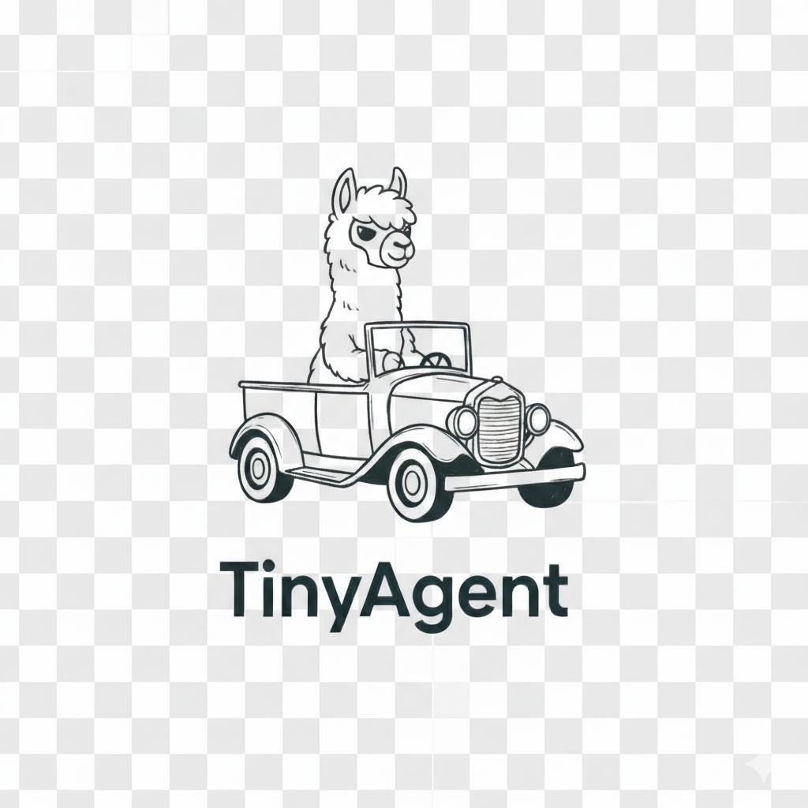
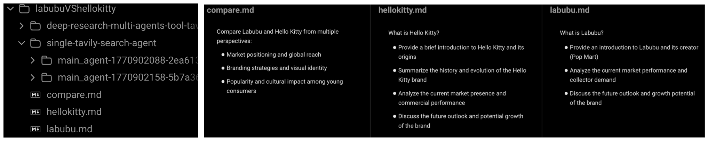
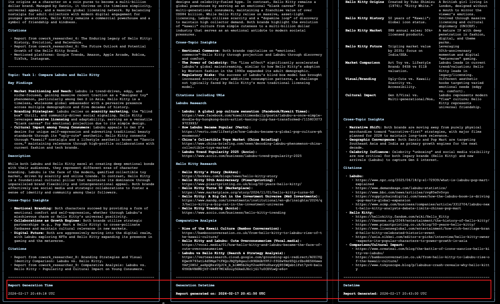

<p align="center">
  
</p>

A personal hobby project for building various agentic applications. The whole point is to make it easy to spin up new agentic apps, so the agent components are built from scratch — implemented wherever I feel the need during development, rather than chasing excessive code reuse or textbook "design patterns". Designed with a **keep-it-simple** philosophy — currently only supports:

- [Google GenAI SDK](https://github.com/googleapis/python-genai) (including Vertex AI)
- [Ollama](https://github.com/ollama/ollama)

Whether it will be expanded in the future? We'll see. No promises.

---

## Table of Contents

- [Environment Setup](#environment-setup)
- [Agent Use](#agent-use)
  - [Google GenAI (Vertex AI / AI Studio)](#google-genai-vertex-ai--ai-studio)
  - [Ollama](#ollama)
  - [Common Notes](#common-notes)
- [Apps](#apps)
  - [Run Examples](#run-examples)
    - [📝 Run Tasks](#run-tasks)
    - [🏗️ Run App Builder](#run-app-builder)
  - [🛠️ Developing Apps](#developing-apps)
  - [🤖 Coding-Agent](#coding-agent)
  - [🏗️ App Builder](#app-builder)
- [🧪 Experiments](#experiments)
  - [Experiment I: Single Agent vs Tool-Driven Multi-Agent](#experiment-i)
  - [Experiment II: Single Agent vs Tool-Driven Multi-Agent vs Sub-Agent Multi-Agent](#experiment-ii)
- [📦 Tools](#tools)
- [🤖 Sub-Agents](#sub-agents)
- [Agent Output Artifacts](#agent-output-artifacts)
- [Troubleshooting: Google GenAI Credentials](#troubleshooting-google-genai-credentials)
- [Star History](#star-history)
- [License](#license)

---

## Environment Setup

Copy `apps/env_sample` to `apps/.env` and fill in your values:

```bash
cp apps/env_sample apps/.env
```

This configures **Google GenAI**, **Ollama**, and **Tavily** API keys. See `apps/env_sample` for all available variables.

### Google GenAI: Vertex AI vs Google AI Studio (Mutually Exclusive)

For Google models, you can choose **exactly one** of the following authentication modes:

- **Vertex AI (recommended for GCP users)**
  - Set `GOOGLE_GENAI_USE_VERTEXAI=true`
  - Set `GOOGLE_CLOUD_PROJECT` and `GOOGLE_CLOUD_LOCATION`
  - Authenticate via ADC (see the troubleshooting section below)

- **Google AI Studio API Key**
  - Set `GOOGLE_GENAI_USE_VERTEXAI=false`
  - Set `GOOGLE_AI_STUDIO_API_KEY`

These two modes are **mutually exclusive**: when `GOOGLE_GENAI_USE_VERTEXAI=true`, the AI Studio API key will not be used.

<a id="ollama-env"></a>

### Ollama

When using the Ollama backend, configure the server address. The resolution order is:

1. `OLLAMA_BASE_URL` — Ollama on the **host machine** (checked first). Typical value: `http://host.docker.internal:11434` when the agent runs inside a Docker container but Ollama runs on the host.
2. `OLLAMA_HOST` — Ollama **inside the container** (fallback). Typical value: `http://localhost:11434`.
3. Default: `http://localhost:11434`.

This matches the lookup logic used in apps (e.g. `apps/single-ollama-agent/agent.py`):

```python
os.environ.get("OLLAMA_BASE_URL", os.environ.get("OLLAMA_HOST", "http://localhost:11434"))
```

These are only needed when using `ollama_stuff` in `TinyAgent`.

### Tavily

- `TAVILY_API_KEY_0` is **required** at minimum.
- You can register multiple Tavily API keys — number them starting from `0` (e.g. `TAVILY_API_KEY_0`, `TAVILY_API_KEY_1`, `TAVILY_API_KEY_2`, ...).

---

### 🚀 Build and local deploy

```bash
docker compose build
docker compose up -d
```

### Enter container

```bash
docker exec -it TinyAgentDev /bin/bash
```

### 📋 Logging

```bash
docker logs -f TinyAgentDev
```

---

## Agent Use

`TinyAgent` supports two **mutually exclusive** backends — **Google GenAI** (Vertex AI or AI Studio) and **Ollama**. You must provide exactly one of `genai_stuff` or `ollama_stuff` when creating an agent.

### Google GenAI (Vertex AI / AI Studio)

See [`apps/single-tavily-search-agent/agent.py`](apps/single-tavily-search-agent/agent.py) for a full working example.

```python
from tiny_agent.agent.tiny_agent import TinyAgent
from tiny_agent.agent.agent_manager import AgentManager

agent = TinyAgent(
    name="my_agent",
    model="gemini-2.5-flash",
    output_root="./output",
    genai_stuff={
        # Provider — pick one (mutually exclusive):
        # Vertex AI
        "vertexai": True,
        "vertexai_project": "<your-project-id>",
        "vertexai_location": "europe-west4",
        # Google AI Studio
        # "vertexai": False,
        # "google_ai_studio_api_key": "<your-api-key>",
    },
    tools=[...],            # list of tool functions
    # subagents=[...],      # optional sub-agents
    # Model options passed as **kwargs
    temperature=1.0,
    seed=42,
)

try:
    result = agent(contents="Your task or question here")
finally:
    AgentManager().unregister(agent.agent_id)
```

`genai_stuff` accepts the following keys (all optional except the provider choice):

| Key | Description |
|-----|-------------|
| `system_instruction` | Custom system prompt (defaults to built-in) |
| `vertexai` | `True` for Vertex AI, `False` for AI Studio |
| `vertexai_project` | GCP project ID (required when `vertexai=True`) |
| `vertexai_location` | GCP region (required when `vertexai=True`) |
| `google_ai_studio_api_key` | API key (required when `vertexai=False`) |
| `http_options` | `types.HttpOptions` for retry/timeout config |

### Ollama

See [`apps/single-ollama-agent/agent.py`](apps/single-ollama-agent/agent.py) for a full working example.

```python
from tiny_agent.agent.tiny_agent import TinyAgent
from tiny_agent.agent.agent_manager import AgentManager

agent = TinyAgent(
    name="my_agent",
    model="qwen3:8b",
    output_root="./output",
    ollama_stuff={
        "host": "http://localhost:11434",
    },
    tools=[...],            # list of tool functions
    # subagents=[...],      # optional sub-agents
    # Model options passed as **kwargs
    think=True,
    options={"temperature": 0.5, "top_p": 0.5, "top_k": 10},
)

try:
    result = agent(contents="Your task or question here")
finally:
    AgentManager().unregister(agent.agent_id)
```

`ollama_stuff` accepts the following keys (all optional):

| Key | Description |
|-----|-------------|
| `system_instruction` | Custom system prompt (defaults to built-in) |
| `host` | Ollama server URL (defaults to `http://localhost:11434`). See [Environment Setup > Ollama](#ollama-env) for env var configuration. |

### Common Notes

- `genai_stuff` and `ollama_stuff` are **mutually exclusive** — providing both raises `ValueError`.
- `tools` — a list of functions decorated with `@tool()` (see [Tools](#tools)).
- `subagents` — optional list of sub-agent instances (see [Sub-Agents](#sub-agents)).
- `**kwargs` — additional model config options (e.g. `temperature`, `seed` for GenAI; `think`, `options` for Ollama).
- Wrap the agent call in `try/finally` and call `AgentManager().unregister(agent.agent_id)` to clean up the agent from the singleton registry after execution.
- The agent writes artifacts (work plan, memory, reflection, result) to `<output_root>/<agent-name>-<agent-id>/` (see [Agent Output Artifacts](#agent-output-artifacts)).

---

## Apps

| App | Backend | Description | 🐳 Inside Container | 💻 Local Computer (CLI) |
|-----|---------|-------------|-----------------|-----------------|
| `apps/single-tavily-search-agent` | Google GenAI | Single agent with Tavily web search | `cd apps/single-tavily-search-agent`<br>`python ./agent.py --output ./agent-output`<br>[More ↓](#run-inside-container) | `CLIs/single-tavily-search-agent.sh`<br>`--output ./my-output --tasks ./my-tasks`<br>[More ↓](#run-from-host) |
| `apps/single-ollama-agent` | Ollama | Single agent with web search via Ollama | `cd apps/single-ollama-agent`<br>`python ./agent.py --output ./agent-output --tasks ./tasks`<br>[More ↓](#run-inside-container) | `CLIs/single-ollama-agent.sh`<br>`--output ./my-output --tasks ./my-tasks`<br>[More ↓](#run-from-host) |
| `apps/deep-research-multi-agents-tool-tavily-search` | Google GenAI | Deep research via tool calls that spawn multiple TinyAgents concurrently with Tavily search | `cd apps/deep-research-multi-agents-tool-tavily-search`<br>`python ./deep-research.py --output ./deep-research-output --tasks ./my-tasks`<br>[More ↓](#run-inside-container) | `CLIs/deep-research-multi-agents-tool-tavily-search.sh`<br>`--output ./my-output --tasks ./my-tasks`<br>[More ↓](#run-from-host) |
| `apps/deep-agents-research` | Google GenAI | Deep agents research with a lead agent coordinating multiple sub-agents | `cd apps/deep-agents-research`<br>`python ./deep-research.py --output ./deep-research-output --tasks ./my-tasks`<br>[More ↓](#run-inside-container) | `CLIs/deep-agents-research.sh`<br>`--output ./my-output --tasks ./my-tasks`<br>[More ↓](#run-from-host) |
| `apps/sequential-reflection-agent` | Google GenAI | Sequential agent that runs step-by-step with analysis, reflection, revision, and a final compose-report stage | `cd apps/sequential-reflection-agent`<br>`python ./sequential-reflection-agent.py --output ./sequential-reflection-agent-output --tasks ./my-tasks`<br>[More ↓](#run-inside-container) | `CLIs/sequential-reflection-agent.sh`<br>`--output ./my-output --tasks ./my-tasks`<br>[More ↓](#run-from-host) |
| `apps/app-builder` | Google GenAI | Builds a CLI `.sh` script for any app given the path to its main file. Takes `--main` pointing to the app's entry-point `.py` file, reads its `argparse` definition, references existing `CLIs/*.sh` scripts, and generates a new matching `.sh` under `CLIs/`. 👍 The `CLIs/app-builder.sh` script itself was built by this app! | `cd apps/app-builder`<br>`python ./app-builder.py --main /path/to/apps/my-app/main.py`<br>[More ↓](#run-inside-container) | `CLIs/app-builder.sh`<br>`--main /path/to/apps/my-app/main.py`<br>[More ↓](#run-from-host) |

- `--output` (required): Output directory for results.
- `--tasks`: Directory containing task files (`.md`). **Required** when running from host via CLI. Optional inside container (defaults to `./tasks/` in the app folder).
- **Inside container**: Enter with `docker exec -it TinyAgentDev /bin/bash` first.
- **From host**: CLI scripts handle Google Cloud ADC authentication and resolve `--output`/`--tasks` paths relative to your current directory automatically.

<a id="coding-agent"></a>

### 🤖 Coding-Agent

This section explains how the repo's Python coding agent works end-to-end — from prompt template, to CLI entry-point, to how coding tools are stringified and registered.

🔥 **Scope note**: At the moment, `TinyCodingAgent` only generates a single Python program file: `main.py`. That generated `main.py` is expected to include a bootstrap section that installs dependencies (via `pip`) every run.

🧪 **Sandbox note**: Special thanks to the whole vibe-coding era — it enabled a practical “container-in-container” sandbox so the agent can safely execute arbitrary Python programs. In this repo, that sandbox execution is implemented as the tool `run_python_file` in `tiny_agent/tools/coding/run_code.py`.

#### 1) `TinyCodingAgent` and `CODING_AGENT_INSTRUCTION`

The core implementation lives in `tiny_agent/agent/tiny_coding_agent.py`. The key idea is that the agent is driven by a long template string, `CODING_AGENT_INSTRUCTION`, which tells the model how to:

- Treat `coding_tools` as pre-written functions to be copied verbatim into the generated `main.py`.
- Bootstrap dependencies on every run (fresh container) via `pip install`.
- Execute the generated `main.py` in a sandboxed environment via the built-in tool `run_python_file`.

At runtime, `TinyCodingAgent.get_main_work_instruction()` renders the instruction by substituting:

- `{coding_tools}` with the stringified coding tool functions.
- `{perf_libs}` with user-suggested dependency names (see the next subsection).
- `{output_path}` (and related paths) to control where `main.py` and outputs are written.

#### 2) `apps/coding-agent/coding-agent.py` entry-point and how `perf_libs` / `coding_tools` are wired

The CLI app entry-point is `apps/coding-agent/coding-agent.py`.

It is designed to be launched directly (see the one-line comment above the `__main__` block) and provides a small `argparse` interface:

- `--output` (required): where the agent writes its artifacts.
- `--deps` (optional): path to a `requirements.txt`-style file. The lines are read into `perf_libs` and then injected into the `CODING_AGENT_INSTRUCTION` template as `{perf_libs}`.
- `--coding-tools` (optional): a text file listing tool names (one per line). The names are looked up in `tiny_agent.tools.CODING_TOOLS` to produce the actual callables passed into `TinyCodingAgent`.

These two arguments map directly to the agent constructor:

- `perf_libs=perf_libs`: dependency suggestions that the model should always include in the bootstrap `pkgs` list.
- `coding_tools=coding_tools`: the set of allowed pre-written functions the model can copy into `main.py`.

#### 3) `@coding_tool` and why tool docstrings/source show up in `{coding_tools}`

The decorator `coding_tool` is implemented in `tiny_agent/tools/decorator.py`.

Unlike a plain `@tool()`, a callable wrapped with `@coding_tool()` is represented by an object whose `__str__` returns the original function source via `inspect.getsource()`. This is important because `TinyCodingAgent` renders `{coding_tools}` using `str(tool_func)`.

As a result:

- The tool's full function body is embedded into the instruction.
- The tool's docstring (as part of the function body) is also included in the `str(...)` output.

You can see this pattern in tool implementations such as `tiny_agent/tools/eco/fin.py`, where coding tools are defined as regular Python functions and then exposed to the coding agent.

#### 4) Coding tool registration: `tiny_agent/tools/__init__.py`

`TinyCodingAgent` does not magically discover tools by scanning files. Any coding tool that can be selected via `--coding-tools` must be registered in `tiny_agent/tools/__init__.py` under the `CODING_TOOLS` mapping.

This makes the selection explicit and keeps the surface area of executable code controlled:

- Add a new coding tool implementation (e.g. under `tiny_agent/tools/...`).
- Import it and register it in `tiny_agent/tools/__init__.py`.
- Then it becomes selectable by name from `apps/coding-agent/coding-agent.py`.

### Model & Provider Configuration

Each app defines its own model names, model options, and provider settings directly in its entry-point `.py` file (the file where the app main lives). Web search tools (`tiny_agent/tools/web/`) are configured by injecting attributes onto the tool functions (e.g. `google_search.search_model`, `tavily_search.summarize_model`) inside that app entry file.

```python
# Provider (Vertex AI vs Google AI Studio — mutually exclusive)
PROVIDER_CONFIG = {
    "vertexai": bool(os.environ.get("GOOGLE_GENAI_USE_VERTEXAI", True)),
    "vertexai_location": os.environ.get("GOOGLE_CLOUD_LOCATION", "europe-west4"),
    "vertexai_project": os.environ.get("GOOGLE_CLOUD_PROJECT", "<your-project-id>"),
    "google_ai_studio_api_key": os.environ.get("GOOGLE_AI_STUDIO_API_KEY", ""),
}

# Search agent — used by web tools (see tiny_agent/tools/web/)
SEARCH_AGENT_MODEL = "gemini-2.5-flash-lite"
SEARCH_AGENT_MODEL_CONFIG = { "temperature": 1.0, "seed": 42, ... }

# Summarization — used by web tools (see tiny_agent/tools/web/)
SUMMARIZE_MODEL = "gemini-2.5-flash-lite"
SUMMARIZE_MODEL_CONFIG = { "temperature": 0.0, "seed": 42, ... }
```

See the following files for examples of how to define these:
- `apps/single-tavily-search-agent/agent.py` — single GenAI agent config
- `apps/single-ollama-agent/agent.py` — single Ollama agent config
- `apps/deep-research-multi-agents-tool-tavily-search/deep-research.py` — multi-agent config (main + research agents)
- `apps/app-builder/app-builder.py` — app-builder agent config

### Run Examples

<a id="run-tasks"></a>

#### 📝 Run Tasks

You can organize research tasks in separate `.md` files. Each file contains prompts that guide the agent's research focus.

**Example directory structure:**
```
labubuVShellokitty/
├── labubu.md
├── hellokitty.md
└── compare.md
```

**Example task file (`labubu.md`):**
```markdown
What is Labubu?
- Provide an introduction to Labubu and its creator (Pop Mart)
- Analyze the current market performance and collector demand
- Discuss the future outlook and growth potential of the brand
```

**Example task file (`hellokitty.md`):**
```markdown
What is Hello Kitty?
- Provide a brief introduction to Hello Kitty and its origins
- Summarize the history and evolution of the Hello Kitty brand
- Analyze the current market presence and commercial performance
- Discuss the future outlook and potential growth of the brand
```

**Example task file (`compare.md`):**
```markdown
Compare Labubu and Hello Kitty from multiple perspectives:
- Market positioning and global reach
- Branding strategies and visual identity
- Popularity and cultural impact among young consumers
```

<a id="run-app-builder"></a>

#### 🏗️ Run App Builder

Create a new app directory under `apps/` with a Python entry-point. The app can have multiple `.py` files, but **only one main** (the file with `argparse` and the `if __name__ == "__main__"` block).

**Example app structure:**
```
apps/my-new-app/
├── my-new-app.py    ← main (only one per app)
├── helper.py
└── utils.py
```

Then generate its CLI shell script inside the container:

```bash
$APP_BUILDER --main apps/my-new-app/my-new-app.py
```

The generated `CLIs/my-new-app.sh` is ready to use immediately.

#### Run Inside Container

```bash
docker exec -it TinyAgentDev /bin/bash

# Single agent
cd apps/single-tavily-search-agent
python ./agent.py --output ./agent-output --tasks /path/to/labubuVShellokitty

# Deep research
cd apps/deep-research-multi-agents-tool-tavily-search
python ./deep-research.py --output ./deep-research-output --tasks /path/to/labubuVShellokitty

# Deep agents research
cd apps/deep-agents-research
python ./deep-research.py --output ./deep-agents-research-output --tasks /path/to/labubuVShellokitty

# Sequential reflection agent
cd apps/sequential-reflection-agent
python ./sequential-reflection-agent.py --output ./sequential-reflection-agent-output --tasks /path/to/labubuVShellokitty

# App builder
cd apps/app-builder
python ./app-builder.py --main /path/to/apps/my-app/main.py
```

#### Run From Host

```bash
cd labubuVShellokitty

# Deep research
.../TinyAgent/CLIs/deep-research-multi-agents-tool-tavily-search.sh --output deep-research-multi-agents-tool-tavily-search --tasks .

# Deep agents research
.../TinyAgent/CLIs/deep-agents-research.sh --output deep-agents-research --tasks .

# Sequential reflection agent
.../TinyAgent/CLIs/sequential-reflection-agent.sh --output sequential-reflection-agent --tasks .

# Or single agent
.../TinyAgent/CLIs/single-tavily-search-agent.sh --output single-tavily-search-agent/ --tasks .

# Or single ollama agent
.../TinyAgent/CLIs/single-ollama-agent.sh --output single-ollama-agent/ --tasks .

# App builder
.../TinyAgent/CLIs/app-builder.sh --main /path/to/apps/my-app/main.py
```

<a id="developing-apps"></a>

### 🛠️ Developing Apps

All apps are developed under the `apps/` directory. To create a new app, add a new subdirectory there, and put your model/provider configuration (including web search tool attribute injection) in the app entry-point `.py` file (the one that contains the `if __name__ == "__main__"` block). To publish a new app for host-side CLI usage, add a corresponding shell script under `CLIs/` and a service entry in `docker-compose.yml`, following the existing ones as a reference.

<a id="app-builder"></a>

### 🏗️ App Builder

The **App Builder** (`apps/app-builder`) is a meta-app — a single `TinyAgent` that builds CLI shell scripts for other apps.

Every app in this repo follows a convention: a Python entry-point with `argparse`, a Docker Compose service, and a wrapper `.sh` script under `CLIs/` that handles host-side concerns (ADC authentication, path resolution, volume mounts). Writing these `.sh` scripts by hand is repetitive, so the App Builder automates it.

**How it works:**

1. You point it at an app's main `.py` file via `--main`.
2. The agent reads all existing `CLIs/*.sh` scripts to learn the common structure and conventions.
3. It reads the target file's `argparse` section to extract every argument — name, type, required/optional, and whether it represents a directory path, file path, or plain value.
4. It generates a new `.sh` script that mirrors the reference scripts but adapts the argument handling to match the target app's `argparse` definition:
   - **Directory paths** → resolved, mounted as Docker volumes.
   - **File paths** → resolved, parent directory mounted as a Docker volume.
   - **Plain values** → forwarded as-is.
5. The generated script is saved to `CLIs/<parent-dir-name>.sh`, named after the target app's directory.

This means publishing a new app to the CLI is as simple as running:

```bash
python apps/app-builder/app-builder.py --main apps/my-new-app/main.py
```

Inside the container, the environment variable `$APP_BUILDER` points to `/app/CLIs/app-builder.sh`, so you can also run:

```bash
$APP_BUILDER --main apps/my-new-app/main.py
```

> **Note:** If the image hasn't been rebuilt since adding the `chmod +x` step in the Dockerfile, you may need to run `chmod +x /app/CLIs/app-builder.sh` manually inside the container first.


<a id="experiments"></a>

## 🧪 Experiments

> **Note**: Experiment results are for reference only. Actual performance may vary depending on hardware, network conditions, model versions, and other factors.

<a id="experiment-i"></a>

### Experiment I: Single Agent vs Tool-Driven Multi-Agent

This experiment compares two design patterns:

- `apps/single-tavily-search-agent`: a single agent that iterates on a task and uses Tavily search. It processes tasks sequentially — seemingly straightforward, but this simplicity makes it the easiest pattern to reason about and debug.
- `apps/deep-research-multi-agents-tool-tavily-search`: a supervisor-style deep-research workflow (tool-driven), where a lead agent decomposes work and orchestrates multiple concurrent research agents.

In this experiment, the **tool-driven multi-agent** pattern is generally **better** than a single-agent loop:

- **Coverage**: parallel sub-agents can explore different angles and sources.
- **Speed**: concurrency reduces wall-clock time for wide research.
- **Robustness**: even if one sub-agent underperforms, the overall result can still be strong.

> **⚠️ Warning**
>
> Both apps rely on **random task decomposition** (randomly splitting the task into topics/subtopics). As a result, each run can produce different intermediate topics and the overall output quality/performance can vary from run to run.

🎥 YouTube walkthrough (click the preview):

[](https://youtu.be/JMOZ5JFBYyo)

---

<a id="experiment-ii"></a>

### Experiment II: Single Agent vs Tool-Driven Multi-Agent vs Sub-Agent Multi-Agent

This experiment extends Experiment I by adding a third pattern, comparing all three:

- `apps/single-tavily-search-agent`: a single agent that iterates on a task and uses Tavily search.
- `apps/deep-research-multi-agents-tool-tavily-search`: a tool-driven multi-agent workflow where the lead agent decomposes the task into as many subtasks as there are CPU cores, then spawns concurrent research agents via multithreading to handle them in parallel.
- `apps/deep-agents-research`: a sub-agent multi-agent workflow where a fixed number of sub-agents (equal to the CPU core count) are pre-created, and the lead agent dispatches subtasks to them hierarchically, then synthesizes a final report.

#### Results

1. **Tool-driven multi-agent** (`deep-research-multi-agents-tool-tavily-search`) was the **fastest** by a clear margin. Its implementation decomposes the task into a number of subtasks matching the available CPU cores, then launches research agents concurrently via multithreading — maximizing parallelism.

2. **Single agent** (`single-tavily-search-agent`) came in **second**. It processes tasks sequentially one by one — seemingly straightforward, but this simplicity makes it the easiest to understand and debug. Despite this, it was still faster than the sub-agent approach.

3. **Sub-agent multi-agent** (`deep-agents-research`) was the **slowest**. Like the tool-driven variant, it also decomposes the task based on CPU core count and pre-creates that many sub-agents. However, the lead agent randomly decides how to assign subtasks to those sub-agents — it may assign 3–4 sub-agents to a single subtask, or have one sub-agent handle a task alone. This unpredictable allocation leads to uneven workload distribution and longer overall execution time.

#### Takeaways

- Structured, deterministic parallelism (tool-driven, CPU-core-based decomposition) significantly outperforms random agent orchestration.
- Sub-agent flexibility comes at a cost: without a deliberate allocation strategy, random assignment can lead to worse performance than a simple single-agent loop.
- As noted in Experiment I, all apps rely on random task decomposition, and results will vary across runs depending on hardware, network conditions, and the nature of the task.
- Additionally, both multi-agent variants (tool-driven and sub-agent) rely on **parallel threading**, which inherently introduces non-determinism — thread scheduling, network latency per thread, and API rate limits can all cause fluctuations between runs. This is a contributing factor to the variability observed across experiments.

🎥 YouTube walkthrough (click the preview):

<a href="https://youtu.be/F2oV1Pr2LWA"></a>


<a id="tools"></a>

## 📦 Tools

Tools are the callable capabilities exposed to agents. In this repo there are two main categories:

Note: web search tools require configuration to be injected in an app entry file under `apps/` (the file where the app main lives). This is one reason app development is coupled with the repo's library code, and why new apps are typically developed under the `apps/` directory.

| Category | What it provides | Source files |
|----------|------------------|-------------|
| **Built-in tools** | Local filesystem read/write helpers, datetime helpers, and the agent's on-disk artifacts helpers (work plan, memory, reflection). | `tiny_agent/tools/buildins/core.py` (work plan, memory, reflection), `tiny_agent/tools/buildins/filesys.py` (file read/write/append/exists, list dir), `tiny_agent/tools/buildins/utils.py` (datetime helpers), plus shared wiring in `tiny_agent/tools/decorator.py` |
| **Web tools** | Web search and retrieval tools.<br><br>**Tavily search**: requires `TAVILY_API_KEY_0` at minimum (optionally `TAVILY_API_KEY_1`, `TAVILY_API_KEY_2`, ...).<br><br>**Google search**: uses the Google GenAI SDK and follows the same auth/config described above (Vertex AI vs Google AI Studio via `GOOGLE_GENAI_USE_VERTEXAI`, `GOOGLE_CLOUD_PROJECT`, `GOOGLE_CLOUD_LOCATION`, `GOOGLE_AI_STUDIO_API_KEY`). | `tiny_agent/tools/web/` (`__init__.py`, `tavily_search.py`, `google_search.py`, `base_web_search.py`, `tools.py`) |

---

<a id="sub-agents"></a>

## 🤖 Sub-Agents

Sub-agents are specialized `TinyAgent` instances that a parent agent can delegate tasks to. They are registered as children of a parent agent and invoked via built-in transfer tools during execution.

### Defining a Sub-Agent

Use the `@subagent` decorator on a `TinyAgent` subclass. The class docstring becomes the sub-agent's description (visible to the parent agent when deciding which sub-agent to use).

So for sub-agents, the `TinyAgent` class docstring is **meaningful**: it is not just documentation, it is part of the routing signal the parent agent uses for delegation.

```python
from tiny_agent.subagent.decorator import subagent
from tiny_agent.agent.tiny_agent import TinyAgent

@subagent
class AddAgent(TinyAgent):
    """Perform addition (math)."""
    ...

@subagent(is_async=True)
class ResearchAgent(TinyAgent):
    """A research sub-agent that performs web searches."""
    ...
```

- `@subagent` or `@subagent()` — marks a sync sub-agent.
- `@subagent(is_async=True)` — marks an async sub-agent (required for parallel execution).

### Registering Sub-Agents

Pass sub-agent instances to the parent agent's `subagents` parameter:

```python
add_agent = AddAgent(name="add_agent", model="gemini-2.5-flash", ...)
mul_agent = MulAgent(name="mul_agent", model="gemini-2.5-flash", ...)

parent = TinyAgent(
    name="main_agent",
    model="gemini-2.5-flash",
    subagents=[add_agent, mul_agent],
    ...
)
```

> **Note:** Sub-agent names must be unique and cannot match the parent agent's name.

### Transfer Patterns

The parent agent uses two built-in tools to delegate work to sub-agents:

| Pattern | Tool | When to use |
|---------|------|-------------|
| **ONE-TO-ONE** | `transfer_to_subagent` | Transfer a task to a **single** sub-agent. Pass the sub-agent's name as a string. |
| **ONE-TO-MANY** | `transfer_to_subagents` | Transfer a task to **multiple** sub-agents in parallel. Pass a list of sub-agent names. Only sub-agents with `is_async=True` can be used. |

**ONE-TO-ONE** is for sequential delegation — the parent waits for the sub-agent to finish before continuing. **ONE-TO-MANY** runs all target sub-agents concurrently using threads (worker count is based on CPU cores) and returns a dict mapping each sub-agent name to its result.

### Decision Flow

The parent agent is instructed to reflect before every transfer:

1. Do I need one sub-agent or multiple sub-agents for this task?
2. If multiple, can they work in parallel, or do they depend on each other's results?
   - **Parallel** → `transfer_to_subagents` (ONE-TO-MANY)
   - **Sequential dependency** → `transfer_to_subagent` (ONE-TO-ONE), called one after another
3. Why this particular sub-agent(s)?
4. Is the task description clear and complete?

### Source Files

| File | Description |
|------|-------------|
| `tiny_agent/subagent/decorator.py` | `@subagent` decorator |
| `tiny_agent/tools/buildins/subagents_helper.py` | `transfer_to_subagent` and `transfer_to_subagents` tools |
| `tiny_agent/agent/agent_manager.py` | Singleton agent registry (enforces unique names) |

---

## Agent Output Artifacts

During execution, agents produce several files in the `--output` directory. These artifacts serve as the agent's "memory" and reasoning trace. The agentic tools are defined in `tiny_agent/tools/buildins/core.py`, filesystem tools in `tiny_agent/tools/buildins/filesys.py`, and datetime tools in `tiny_agent/tools/buildins/utils.py`.

| File | Description | Read/Write Pattern |
|------|-------------|--------------------|
| `work_plan.md` | The agent's structured work plan (a.k.a. todo list). Created at the start of a task and updated as the agent progresses through sub-tasks. | Created via `create_work_plan`, read via `read_work_plan`, updated via `update_work_plan` |
| `memory.md` | Accumulated execution context and key findings. The agent appends entries as it discovers new information, acting as a persistent scratchpad across steps. | Read via `read_memory`, appended via `update_memory` |
| `reflection.md` | The agent's self-reflection and decision-making reasoning. Captures why certain choices were made and lessons learned during execution. | Appended via `reflect` |
| `result.md` | The final research output or deliverable. Contains the synthesized answer or report produced by the agent for the given task. | Written by the agent at the end of execution |

> **⚠️ Warning**
>
> - The file names listed above are **sensitive** — they are hardcoded in the agent's built-in tools. Do not rename them.
> - Each agent writes to its own `output_location` directory (pattern: `<--output>/<agent-name>-<agent-id>/`). To locate a specific artifact, use `output_location` + the file name (e.g. `output_location/result.md`). **Note:** `subagent`s have a default `result.md` output, but a plain `TinyAgent` does not enforce a default result filename at the framework level. In this repo we intentionally standardize on `result.md`: in `tiny_agent/patterns/` (except the sequential reflection pattern) you can see `output_path` being constructed explicitly as `f"{agent.output_location}/result.md"` (e.g. `tiny_agent/patterns/deep_research_multi_agents_tool.py`), and the single-agent apps also set `result.md` from the outside (e.g. `apps/single-tavily-search-agent/agent.py` and `apps/single-ollama-agent/agent.py`). The sequential reflection agent's subagents rely on the default `result.md`.
> - **Not all files are guaranteed to appear.** Different models have varying performance — if an agent fails or the model does not follow the expected tool-calling pattern, some artifacts (e.g. `work_plan.md`, `reflection.md`) may be missing from the output.

---

## Troubleshooting: Google GenAI Credentials

This section applies when using **Google GenAI / Vertex AI** (not Ollama).

If you encounter `DefaultCredentialsError` or any credential-related error during execution:

- **Inside container**: Run the following command inside the container to authenticate:
  ```bash
  gcloud auth application-default login
  ```
  Follow the prompts to complete the authentication flow.

- **From host (via `CLIs/*.sh`)**: The CLI scripts will automatically detect missing or expired credentials and trigger `gcloud auth application-default login`. This will open a **web browser login dialog** — complete the authentication in the browser, then the script will continue automatically.

---

## Star History

[](https://star-history.com/#XinyueZ/TinyAgent&Date)

---

## License

This project is licensed under the [MIT License](LICENSE).